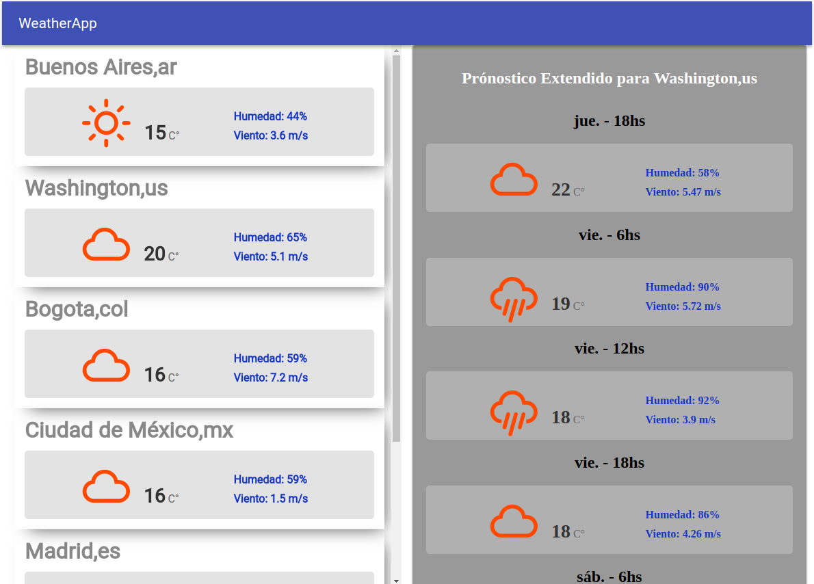

<h1 align="center">
   
  
   
  <a href="https://martinbobbio.github.io/frontend-weather/">Weather APP</a> 
   
</h1>
<h4 align="center"><a target="_blank" href="https://github.com/martinbobbio/backend-weather">Weather - Backend</a></h4>

# Descripción

Test de desarrollo usando la api de OpenWeather para consultar el clima actual y el de los próximos 5 días, adicionalmente otras 5 ciudades.
Otra api consultada es la de Id-Api para consultar la ubicación actual y luego apartir de eso el clima de la ciudad.
Las librerías usadas sosn redux, supertest y express.

# Capturas

### Página

