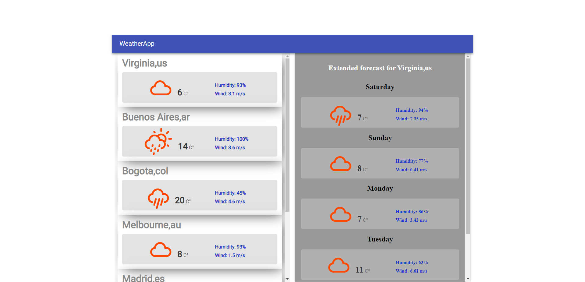

<h1 align="center">
   
  
   
  WeatherApp
   
</h1>

# Descripción

Prácticas desarrolladas sobre el curso de React de Udemy, viendo componentes principales, ciclos de vida, javascript, librerias etc

# Capturas

### Página

